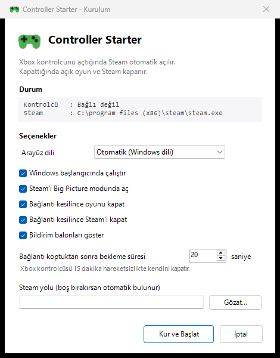

# Controller Starter

**Xbox kontrolcünü aç — Steam açılır. Kapat — oyun ve Steam kapanır.**

Windows'ta konsol gibi bir deneyim: kontrolcüyü eline al, oyna, bırak. Klavye yok, fare yok. Bildirim alanında sessizce durur.

[🇬🇧 English](README.md) · 🇹🇷 Türkçe


<p align="center">
  
</p>

---

## İçindekiler

- [Ne yapıyor?](#ne-yapıyor)
- [Hızlı başlangıç](#hızlı-başlangıç)
- [Tepsi simgesi](#tepsi-simgesi)
- [Nasıl çalışıyor?](#nasıl-çalışıyor)
- [Gereksinimler](#gereksinimler)
- [Dosyalar](#dosyalar)
- [Ayarlar](#ayarlar)
- [Sorun giderme](#sorun-giderme)
- [Güvenlik](#güvenlik)
- [.exe hakkında](#exe-hakkında)
- [Kaldırma](#kaldırma)
- [Lisans](#lisans)

---

## Ne yapıyor?

| Olay | Sonuç |
|---|---|
| Kontrolcü bağlandı (Bluetooth, USB veya Xbox Wireless Adapter) | Steam açılır — varsayılan olarak **Big Picture** modunda |
| Kontrolcü kapandı veya bağlantısı koptu | Açık Steam oyunu nazikçe kapatılır, ardından Steam kapanır |
| Kontrolcü bir anlığına koptu | Hiçbir şey olmaz — süre dolmadan geri gelirse oyunun çalışmaya devam eder |
| Kontrolcü açıkken Steam'den sen çıktın | Steam yeniden açılmaz; kontrolcüyü kapatıp açman beklenir |

## Hızlı başlangıç

1. [Son sürümden](https://github.com/SametEge/ControllerStarter/releases/latest) **`ControllerStarterSetup.exe`** dosyasını indir.
2. Çalıştır, seçeneklerini işaretle, **Kur**'a bas.
3. Kontrolcünü aç.

Kurulum tek dosyadır — uygulama içine gömülüdür. Kullanıcı bazında kurar (yönetici hakkı gerekmez), Başlat menüsüne kısayol ekler ve *Uygulamalar ve özellikler* altına kayıt düşer, yani diğer programlar gibi kaldırılır.

> **Akıllı Uygulama Denetimi açık olan Windows 11'de:** kurulum dosyası imzasızdır ve Windows çalıştırmayı reddeder. Bu özelliği kapatmadan bunu aşmanın bir yolu yok — bkz. [.exe hakkında](#exe-hakkında). Kapatmak istemiyorsan depoyu klonlayıp `app\Setup.bat`'e çift tıkla; tamamen aynı uygulamayı verir.

### Kaynaktan çalıştırmak

```bash
git clone https://github.com/SametEge/ControllerStarter.git
```

Sonra **`app\Setup.bat`**'e çift tıkla. Kurulumun gösterdiği pencerenin aynısını açar. Derlenecek bir şey yok, kurulacak bir şey yok ve Akıllı Uygulama Denetimi bunu engellemez.

Sadece metin teşhis raporu için:

```powershell
powershell -ExecutionPolicy Bypass -File .\app\ControllerStarter.ps1 -Once
```

## Tepsi simgesi

Controller Starter saatin yanındaki bildirim alanında durur. Simgenin rengi ne yaptığını söyler:

| Simge | Anlamı |
|---|---|
| 🟢 Yeşil | Oyun oturumu açık — Steam kontrolcün için başlatıldı |
| ⚪ Gri | Hazır, kontrolcü bekleniyor |
| 🟠 Turuncu | Beklemede (Steam'den sen çıktın ya da duraklatıldı) — kontrolcüyü kapatıp açınca tekrar hazırlanır |

**Sağ tık:** ayarlar, log dosyası, duraklat/devam et ve çıkış. **Çift tık:** doğrudan ayarları açar.

> Windows yeni tepsi simgelerini varsayılan olarak gizler. Saatin yanındaki **˄** okuna tıkla, sonra gamepad simgesini görev çubuğuna sürükleyip sabitle.

## Nasıl çalışıyor?

Kontrolcü algılama, cihaz listesi taramak yerine **XInput** (`XInputGetState`) üzerinden yapılır. Windows'a doğrudan "şu anda bağlı bir gamepad var mı?" diye sorulur; kontrolcü uykuya geçtiğinde veya pili bittiğinde bu anında görülür.

Watcher küçük bir durum makinesidir:

```
Waiting   ── kontrolcü 2 sn bağlı ────────────►  Steam açılır  ──►  Active
Active    ── kontrolcü 20 sn yok ─────────────►  oyun + Steam kapanır  ──►  Waiting
Active    ── kullanıcı Steam'i kapattı ───────►  Suspended
Suspended ── kontrolcü kapalı ────────────────►  Waiting  (tekrar hazır)
```

`Suspended` durumu şunun için var: Steam'den kendi isteğinle çıktığında, kontrolcü hâlâ açık olduğu için Steam'in anında yeniden açılmasını engeller.

**Oyun tespiti.** Bir işlem yalnızca çalıştırılabilir dosyası bir Steam kütüphanesinin `steamapps\common\` klasörü altındaysa oyun sayılır. Kütüphane yolları `libraryfolders.vdf` dosyasından okunur, yani ikinci veya üçüncü diskteki oyunlar da bulunur.

**Kapatma sırası.** Oyunlara önce `CloseMainWindow()` isteği gönderilir (kayıt yapabilsinler diye), 15 saniye verilir, sonra zorla sonlandırılır. Steam `steam.exe -shutdown` ile kapatılır — bu Valve'ın kendi temiz çıkış yoludur.

## Gereksinimler

- Windows 10 veya 11
- Windows PowerShell 5.1 — Windows ile gelir, kurulum gerekmez
- Steam
- XInput uyumlu kontrolcü: Xbox One, Xbox Series, Xbox 360 ve kendini XInput cihazı olarak tanıtan çoğu üçüncü parti kontrolcü

> DualShock ve DualSense kontrolcüleri XInput cihazı değildir, doğrudan görünmezler. DS4Windows veya Steam Input gibi bir çeviri katmanı kullanıyorsan çalışırlar.

## Dosyalar

```
ControllerStarter/
├── app/                       # uygulamanın kendisi — kurulan şey bu
│   ├── ControllerStarterApp.ps1   # tepsi uygulaması, kurulum ve ayar penceresi
│   ├── ControllerStarter.ps1      # arayüzsüz watcher ve -Once teşhisi
│   ├── Core.ps1                   # motor: XInput, Steam, durum makinesi
│   ├── Install.ps1                # otomatik başlatmayı aç
│   ├── Uninstall.ps1              # otomatik başlatmayı kapat
│   ├── Setup.bat                  # kurulum olmadan çalıştır
│   └── config.json                # tüm ayarlar
├── src/                       # C# kaynakları
│   ├── Launcher.cs                # küçük başlatıcı
│   └── Setup.cs                   # kurulum programı
├── build/                     # derleme betikleri
│   ├── Build-Exe.ps1
│   └── Build-Setup.ps1
├── docs/                      # ekran görüntüleri, imzalama politikası
├── .github/workflows/         # CI derlemesi
├── README.md                  # İngilizce sürüm
├── README.tr.md               # bu dosya
└── LICENSE
```

## Ayarlar

Ayarların çoğu kurulum/ayarlar penceresinde. `config.json` tamamını tutar, kutucuğu olmayan birkaçı dahil:

| Anahtar | Varsayılan | Açıklama |
|---|---|---|
| `language` | `"auto"` | Arayüz dili: `auto`, `tr` veya `en`. `auto`, Windows dilini izler. |
| `steamExePath` | `""` | Boşsa kayıt defterinden otomatik bulunur. |
| `steamLaunchArgs` | `["-bigpicture"]` | Steam'e verilecek parametreler. `[]` normal Steam penceresi açar. |
| `pollIntervalSeconds` | `2` | Kontrolcü durumunun kaç saniyede bir kontrol edileceği. |
| `connectDebounceSeconds` | `2` | Steam açılmadan önce kontrolcünün kaç saniye bağlı kalması gerektiği. |
| `disconnectGraceSeconds` | `20` | **Önemli.** Bağlantı koptuktan sonra kapatmadan önce beklenecek süre. |
| `launchIfControllerAlreadyConnectedAtStartup` | `false` | Windows açılırken kontrolcü zaten açıksa Steam açılsın mı? |
| `closeGamesOnDisconnect` | `true` | Bağlantı kesilince oyun kapatılsın mı? |
| `closeSteamOnDisconnect` | `true` | Bağlantı kesilince Steam kapatılsın mı? |
| `closeSteamOnlyIfLaunchedByThisTool` | `false` | `true` ise, Steam'i sen açtıysan ona dokunulmaz. |
| `gracefulCloseTimeoutSeconds` | `15` | Oyun zorla kapatılmadan önce tanınan süre. |
| `steamShutdownTimeoutSeconds` | `30` | Steam zorla kapatılmadan önce tanınan süre. |
| `showNotifications` | `true` | Bildirim balonları gösterilsin mi? |
| `extraGameProcessNames` | `[]` | Kapatılacak ek exe adları, ör. `["RiotClientServices.exe"]`. |
| `ignoreProcessNames` | Steam yardımcıları | Asla dokunulmayacak işlem adları. |
| `logEnabled` | `true` | Log dosyası yazılsın mı? |
| `logMaxSizeKB` | `1024` | Log bu boyutu aşınca döndürülür. |

### Değiştirmeye değer ayar

**Xbox kontrolcüsü 15 dakika hareketsizlikte kendini kapatır.** Uzun bir aranın oyununu kapatmasını istemiyorsan ayarlar penceresinden bekleme süresini yükselt, ya da:

```json
"disconnectGraceSeconds": 90
```

## Sorun giderme

**Sadece şarj etmek için taktığımda Steam açılıyor.**
Kabloyla bağlı kontrolcü XInput'ta "bağlı" görünür; şarj ile oynamayı ayırt etmenin bir yolu yok. `launchIfControllerAlreadyConnectedAtStartup` varsayılan olarak `false` olduğu için açılışta bu olmaz; çalışırken takıyorsan `connectDebounceSeconds` değerini yükseltmek kısa takmaları eler.

**Oyun ortasında kontrolcü uyudu ve oyun kapandı.**
Bekleme süresini yükselt — yukarıya bak.

**Steam açılmıyor.**
Ayarlar penceresini aç, *Durum* altındaki `Steam` satırına bak. *Bulunamadı* yazıyorsa Gözat düğmesiyle `steam.exe` dosyasını seç.

**Kontrolcü algılanmıyor.**
Kontrolcü açıkken durum satırı *Bağlı değil* diyorsa XInput onu göremiyor demektir. Windows'un `joy.cpl` ekranında görünüyor mu kontrol et.

**Tepsi simgesini bulamıyorum.**
Saatin yanındaki **˄** okuna tıkla. Gamepad simgesini görev çubuğuna sürükleyip sabitle.

**Steam "Steam is shutting down" ekranında takılıyor.**
Beklenen durum; `steamShutdownTimeoutSeconds` (varsayılan 30 sn) dolunca zorla kapatılır. Sık indirme yapıyorsan bu süreyi uzat.

## Güvenlik

Bu araç işlem kapatıyor, dolayısıyla neye dokunup neye dokunmadığı net olsun:

- Yalnızca çalıştırılabilir dosyası bir Steam kütüphanesinin `steamapps\common\` klasörü altında olan işlemler kapatılır.
- Tek istisna, `config.json` içine **senin** eklediğin `extraGameProcessNames` listesidir.
- Kapatma her zaman önce nazik yoldan denenir; zorla sonlandırma yalnızca zaman aşımından sonra devreye girer.
- Yönetici hakkı istenmez, sistem ayarı değiştirilmez, ağ bağlantısı kurulmaz.

Özellikle otomatik kayıt yapmayan oyunlarda kaydedilmemiş ilerleme yine de kaybolabilir. Bekleme süresini oynama alışkanlığına göre ayarla.

## .exe hakkında

`ControllerStarter.exe`, 16 KB'lık bir başlatıcı: tepsi uygulamasını konsol hiç görünmeden açar. İçine gömülmüş bir yorumlayıcı değil — motor yanındaki, okuyabileceğin PowerShell dosyalarıdır.

### Smart App Control engeli

Çalıştırılabilir dosya **imzasızdır**. **Smart App Control** (Akıllı Uygulama Denetimi) açık olan Windows 11 imzasız ikilileri çalıştırmayı reddeder — çift tıklayınca görünürde hiçbir şey olmaz, konsoldan çalıştırırsan *"Uygulama Denetimi ilkesi bu dosyayı engelledi"* dersin. İmzalamak, güvenilir bir sertifika otoritesinden alınan, kimlik doğrulamalı ve ücretli bir kod imzalama sertifikası gerektirir.

Makineni kontrol et:

```powershell
powershell -ExecutionPolicy Bypass -File .\build\Build-Exe.ps1 -CheckPolicy
```

**On (enforcing)** diyorsa iki seçeneğin var:

- **`app\Setup.bat` kullan.** Toplu iş dosyaları bu kısıttan etkilenmez ve sana aynı tepsi uygulamasını verir. Kapatılacak bir şey yok.
- **Smart App Control'ü kapat:** Windows Güvenliği → Uygulama ve tarayıcı denetimi → Akıllı Uygulama Denetimi. ⚠️ **Bu, Windows'u yeniden kurmadan geri alınamaz** ve korumayı yalnızca bu uygulama için değil, tüm sistem için kaldırır. Tek bir simgenin rahatlığıyla bunu tartarak karar ver.

### Yayınlanan dosya nasıl üretiliyor

Releases sayfasındaki her kurulum dosyası, etiketin işaret ettiği commit'ten, temiz bir Windows runner'ında [GitHub Actions workflow'u](.github/workflows/build.yml) tarafından derleniyor — hiçbir zaman bir geliştirici makinesinden değil. Workflow, yayınlamadan önce ürün meta verisini ve gömülü payload'ın eksiksiz olduğunu doğruluyor.

Bu ikililerin arkasında kimin durduğu, nasıl derlendikleri ve makinende ne yaptıkları [kod imzalama politikasında](docs/code-signing-policy.md) yazılı.

### Kendin derlemek

```powershell
powershell -ExecutionPolicy Bypass -File .\build\Build-Setup.ps1
```

Bu komut, tepsi simgesiyle aynı çizim kodundan çok boyutlu ikonu üretir, `src/Launcher.cs` dosyasını `app/ControllerStarter.exe` olarak derler, `app/` içindekileri ZIP'e paketler ve bu ZIP'i `ControllerStarterSetup.exe` içine gömer. .NET Framework ile gelen C# derleyicisini kullanır, yani kurulacak bir şey yoktur — ve kendin derlemediğin bir ikiliye güvenmek zorunda kalmazsın.

`build\Build-Exe.ps1` yalnızca başlatıcıyı derler, etrafındaki kurulum programı olmadan.

## Kaldırma

`Uninstall.bat`'e çift tıkla, ya da ayarlar penceresinden *Windows başlangıcında çalıştır* kutusunun işaretini kaldırıp tepsi menüsünden **Çıkış**'ı seç. Proje klasörüne dokunulmaz.

## Lisans

[MIT](LICENSE) — Samet Ege
